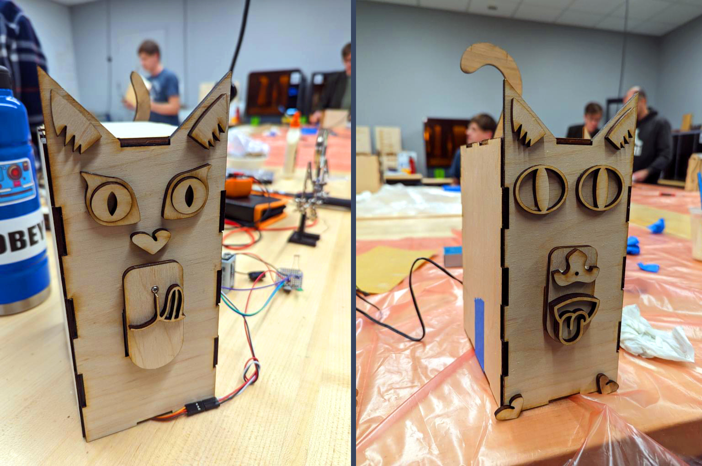

# MeowMunch5000

This is the repository for the MeowMunch5000 automated cat feeder! This is a completely free project that is used for educational purposes to teach hardware, electronics, and software. 

The [Powerpoint](https://github.com/GearsAD/MeowMunch5000/blob/main/MeowMunch%205000.pdf) contains a brief overview of the build instructions.

* `Wood Designs` contains the SVG's to be cut using a laser cutter with 3mm plywood
* `Arduino Code` contains the code for the Arduino Uno
